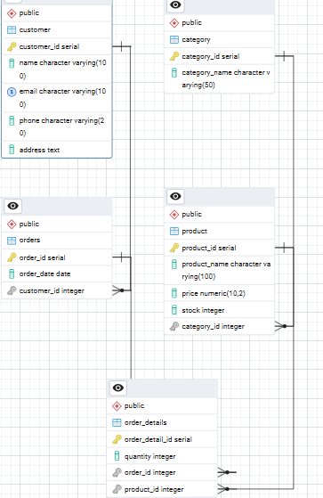

**Task 1: Database Setup and Schema Design.**

**Objective**: Learn to create databases, tables, and define
relationships.

Tools used: pgAdmin

Deliverables: SQL script to create schema and ER diagram

Steps:

1)  Create database using following command: **\**
    Create Database ECommerceDB;

2)  Create tables for Customer, Category, Product ,Orders and
    Order_details

> CREATE TABLE Customer (
>
> customer_id SERIAL PRIMARY KEY, **\# Primary Key**
>
> name VARCHAR(100) NOT NULL,
>
> email VARCHAR(100) UNIQUE NOT NULL,
>
> phone VARCHAR(20),
>
> address TEXT
>
> );
>
> CREATE TABLE Category (
>
> category_id SERIAL PRIMARY KEY, \# Primary Key
>
> category_name VARCHAR(50) NOT NULL
>
> );
>
> CREATE TABLE Product (
>
> product_id SERIAL PRIMARY KEY, \# Primary Key
>
> product_name VARCHAR(100) NOT NULL,
>
> price DECIMAL(10,2) NOT NULL,
>
> stock INT,
>
> category_id INT REFERENCES Category(category_id) #Foreign Key
>
> );
>
> CREATE TABLE Orders (
>
> order_id SERIAL PRIMARY KEY, \# Primary Key
>
> order_date DATE DEFAULT CURRENT_DATE,
>
> customer_id INT REFERENCES Customer(customer_id) #Foreign Key
>
> );
>
> CREATE TABLE Order_Details (
>
> order_detail_id SERIAL PRIMARY KEY, \# Primary Key
>
> quantity INT NOT NULL,
>
> order_id INT REFERENCES Orders(order_id), #Foreign Key
>
> product_id INT REFERENCES Product(product_id) #Foreign Key
>
> );

3)  Create a ER diagram for E-commerce database.

4)  Summery

- The task is **E**-**commerce** Database Schema designed in PostgreSQL.
  In this task, create tables and define relationships between
  customers, products, categories, orders, and order details.

  - **Customer**: Stores customer information.

  - **Category**: Groups products into categories.

  - **Product**: Product details and links to categories.

  - **Orders**: Records customer orders.

  - **Order_Details**: Table connecting orders and products
    (many-to-many relationship).

- An ER diagram is included to visualize the schema.

5)  **Outcome:** The first task is completed and the DbCreate.sql file
    is developed and uploaded to GitHub.
